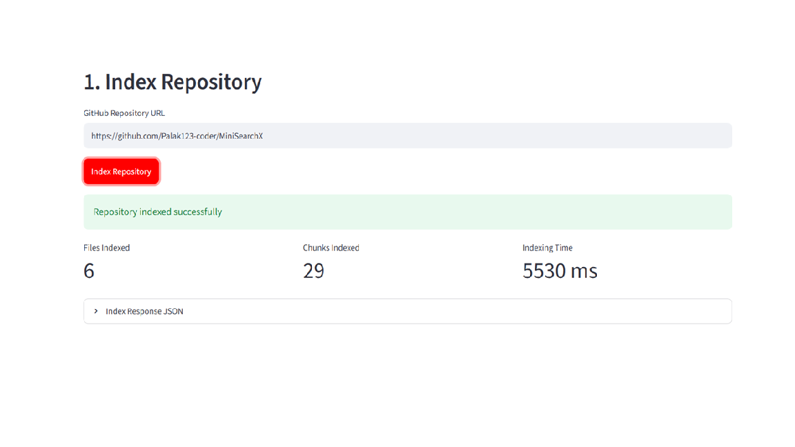
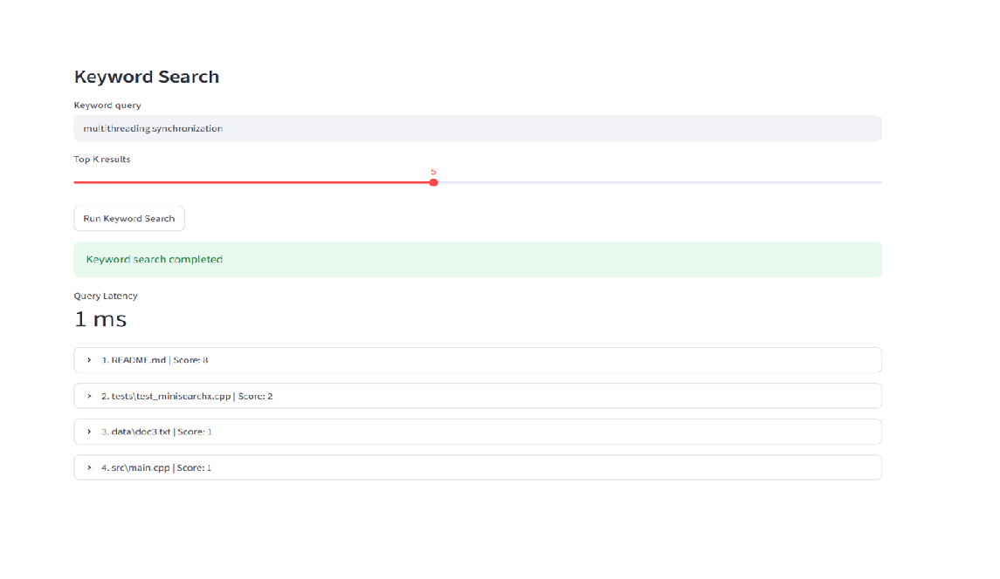
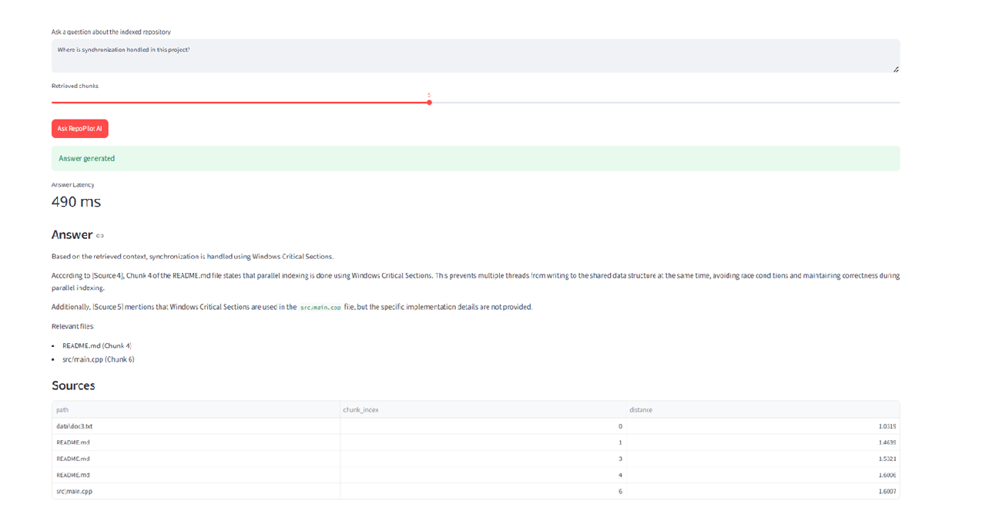
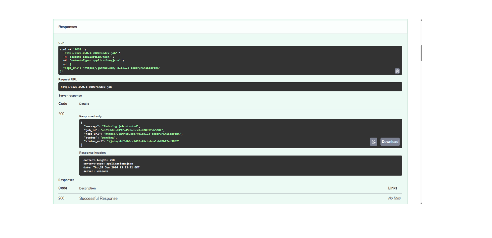
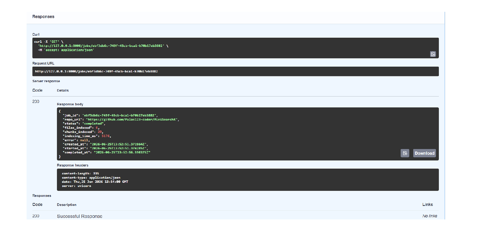
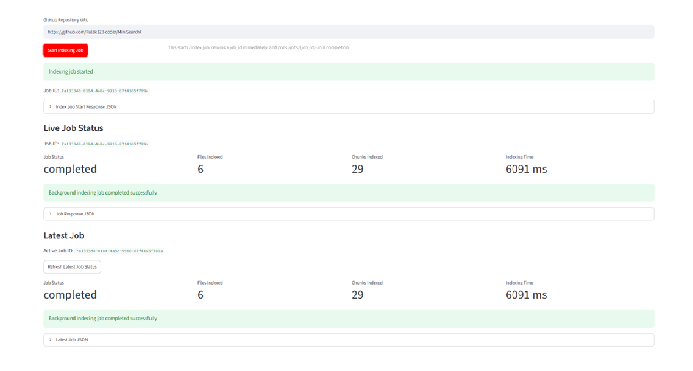

# RepoPilot AI

RepoPilot AI is a FastAPI-based codebase intelligence system that indexes public GitHub repositories and answers developer questions using keyword search, semantic search, RAG-based answer generation, background indexing jobs, persistent SQLite job storage, retry handling, failed-job logs, and an interactive Streamlit dashboard.

The project helps developers understand unfamiliar repositories, locate relevant files, inspect architecture, and debug code faster using repository parsing, code chunking, embeddings, vector search, Groq-powered grounded answers, background job tracking, persistent job history, retry-aware failure handling, status filtering, source file references, and tested core workflows.

## Features

* Accepts a public GitHub repository URL
* Clones the repository locally using GitPython
* Parses supported source-code and documentation files
* Ignores heavy/generated folders like `.git`, `node_modules`, `venv`, `dist`, and `build`
* Indexes file paths and file contents
* Supports keyword-based code search through `/search`
* Splits repository files into overlapping code chunks
* Generates embeddings for code and documentation chunks using SentenceTransformers
* Stores semantic vectors in ChromaDB
* Supports semantic code search through `/semantic-search`
* Supports RAG-based question answering through `/ask`
* Uses semantic retrieval over indexed code chunks before generating answers
* Generates grounded answers using Groq LLM with relevant file references
* Supports synchronous repository indexing through `/index`
* Supports background indexing jobs through `/index-job`
* Provides job tracking through `/jobs/{job_id}`
* Provides job logs through `/jobs/{job_id}/logs`
* Provides persistent job history through `/jobs`
* Stores indexing jobs and job logs in SQLite using `backend/job_store.py`
* Preserves indexing job history across backend restarts
* Supports job filtering by status using `/jobs?status=completed` and `/jobs?status=failed`
* Supports job history limiting using `/jobs?limit=50`
* Tracks job status as `pending`, `running`, `completed`, or `failed`
* Tracks job metadata including `created_at`, `started_at`, `completed_at`, and `attempts`
* Retries failed indexing jobs up to 2 attempts
* Stores per-attempt job logs for start, success, retry, and failure events
* Stores failed-job error messages for debugging
* Tracks repository indexing status, files indexed, chunks indexed, indexing time, and errors
* Provides an interactive Streamlit dashboard for repository indexing, keyword search, semantic search, and RAG-based question answering
* Uses Streamlit dashboard polling to track `/index-job` progress through `/jobs/{job_id}`
* Displays live job status, job ID, files indexed, chunks indexed, and indexing time
* Displays query latency, answer latency, generated answers, and source file references
* Includes unit tests for chunking, repository parsing, ignored-folder filtering, keyword search ranking, top-K retrieval, SQLite job storage, and job logs
* Exposes API documentation through FastAPI Swagger UI

## Tech Stack

* Python
* FastAPI
* Uvicorn
* GitPython
* Pydantic
* Python-dotenv
* SQLite
* ChromaDB
* SentenceTransformers
* Groq API
* RAG
* Streamlit
* Requests
* FastAPI BackgroundTasks
* Threading
* UUID-based job tracking
* Pytest

## Project Structure

```text
RepoPilot-AI/
│
├── backend/
│   ├── __init__.py
│   ├── main.py
│   ├── models.py
│   ├── repo_cloner.py
│   ├── file_parser.py
│   ├── search_engine.py
│   ├── chunker.py
│   ├── vector_store.py
│   ├── rag_agent.py
│   └── job_store.py
│
├── frontend/
│   └── app.py
│
├── tests/
│   ├── test_core.py
│   └── test_job_store.py
│
├── data/
│   ├── .gitkeep
│   ├── cloned_repos/
│   ├── chroma_db/
│   └── repopilot_jobs.db
│
├── screenshots/
│   ├── index-success.png
│   ├── semantic-search-success.png
│   ├── ask-success.png
│   ├── dashboard-index.png
│   ├── dashboard-search.png
│   ├── dashboard-rag.png
│   ├── index-job-started.png
│   ├── job-status-completed.png
│   └── dashboard-job-status.png
│
├── .env.example
├── .gitignore
├── pytest.ini
├── README.md
└── requirements.txt
```

> Note: `data/repopilot_jobs.db`, `data/chroma_db/`, and `data/cloned_repos/` are generated locally and should not be committed to GitHub.

## How It Works

RepoPilot AI follows this workflow:

```text
GitHub repository URL
        ↓
Clone repository using GitPython
        ↓
Parse supported source-code and documentation files
        ↓
Ignore large/generated folders
        ↓
Store files for keyword search
        ↓
Split files into overlapping chunks
        ↓
Generate embeddings for chunks
        ↓
Store embeddings in ChromaDB
        ↓
Retrieve relevant chunks using semantic search
        ↓
Generate grounded answers using Groq LLM
        ↓
Return answer with source file references
```

For background indexing, the workflow becomes:

```text
POST /index-job
        ↓
Create job_id
        ↓
Persist job metadata in SQLite
        ↓
Return response immediately
        ↓
Run indexing in background
        ↓
Retry failed indexing up to 2 attempts
        ↓
Store per-attempt logs in SQLite
        ↓
Update job status and attempt count
        ↓
GET /jobs/{job_id}
        ↓
Check pending/running/completed/failed status
        ↓
GET /jobs/{job_id}/logs
        ↓
Inspect job logs and failure reasons
```

The Streamlit dashboard uses this background indexing workflow and polls the backend until the indexing job is completed.

## File Parsing

RepoPilot AI supports common source-code and documentation file types, including:

* `.py`
* `.js`
* `.ts`
* `.tsx`
* `.jsx`
* `.java`
* `.cpp`
* `.c`
* `.h`
* `.hpp`
* `.cs`
* `.go`
* `.rs`
* `.php`
* `.rb`
* `.md`
* `.txt`
* `.json`
* `.yml`
* `.yaml`

It ignores folders that are usually large, generated, or unnecessary for code understanding:

* `.git`
* `node_modules`
* `venv`
* `.venv`
* `__pycache__`
* `dist`
* `build`
* `.next`
* `.idea`
* `.vscode`

## Keyword Search

The `/search` endpoint performs keyword-based search.

For each indexed file:

1. The file content is tokenized.
2. The query is tokenized.
3. Query-term matches are counted in each file.
4. Files are ranked by match score.
5. The API returns the top-K relevant files with snippets.

This is useful when the user knows the exact terms they want to search for, such as `multithreading`, `synchronization`, `database`, or `authentication`.

## Semantic Search

The `/semantic-search` endpoint performs semantic search using embeddings and ChromaDB.

For each indexed repository:

1. Parsed files are split into overlapping chunks.
2. Each chunk is converted into an embedding using SentenceTransformers.
3. Embeddings are stored in ChromaDB.
4. User queries are converted into embeddings.
5. ChromaDB retrieves semantically similar chunks.
6. The API returns relevant file paths, chunk indexes, distance scores, snippets, and query latency.

This allows RepoPilot AI to find relevant code even when the query does not exactly match the wording used inside the repository.

Example semantic query:

```text
Where is synchronization handled in this project?
```

## RAG Answer Generation

The `/ask` endpoint performs RAG-based question answering over the indexed repository.

For each question:

1. The question is converted into an embedding.
2. ChromaDB retrieves the most relevant code/documentation chunks.
3. Retrieved chunks are passed to the Groq LLM as grounded context.
4. The LLM generates an answer using only the retrieved repository context.
5. The API returns the answer along with relevant file references.

This makes RepoPilot AI useful for architecture understanding, debugging, and feature-navigation questions.

Example RAG question:

```text
Where is synchronization handled in this project?
```

## Background Indexing Jobs

RepoPilot AI supports background indexing jobs for a more scalable and production-like workflow.

Instead of waiting for repository indexing to complete in the same request, `/index-job` returns a `job_id` immediately. The indexing process then runs in the background, and the client can poll `/jobs/{job_id}` to check progress.

This demonstrates:

* Asynchronous backend workflow
* Job tracking
* Status polling
* Error reporting
* Retry handling
* Failed-job logs
* Persistent backend state management
* Separation between request submission and long-running processing
* Reliability-focused job metadata tracking

Job statuses:

```text
pending   → job has been created
running   → repository indexing is in progress
completed → repository indexing completed successfully
failed    → repository indexing failed after retries
```

## SQLite Persistent Job Storage

RepoPilot AI stores indexing jobs and job logs in a local SQLite database at:

```text
data/repopilot_jobs.db
```

This improves reliability because job history is preserved even if the backend server is stopped and restarted.

Each job stores:

* `job_id`
* `repo_url`
* `status`
* `files_indexed`
* `chunks_indexed`
* `indexing_time_ms`
* `error`
* `created_at`
* `started_at`
* `completed_at`
* `attempts`

The `/jobs` endpoint supports status filtering:

```text
GET /jobs
GET /jobs?status=completed
GET /jobs?status=failed
GET /jobs?status=running
GET /jobs?limit=50
```

This makes the job system closer to a production-style long-running task workflow.

## Retry Handling and Failed-Job Logs

RepoPilot AI retries failed background indexing jobs up to 2 attempts.

For every indexing job, RepoPilot AI stores structured logs in SQLite. These logs can be retrieved using:

```text
GET /jobs/{job_id}/logs
```

A successful job usually stores logs like:

```text
Indexing attempt 1 started.
Indexing completed successfully.
```

A failed job stores logs like:

```text
Indexing attempt 1 started.
Indexing attempt 1 failed.
Retrying indexing job after 2 seconds.
Indexing attempt 2 started.
Indexing attempt 2 failed.
Indexing job failed after maximum retry attempts.
```

Each log stores:

* `log_id`
* `job_id`
* `attempt`
* `level`
* `message`
* `error`
* `created_at`

This helps debug failed repository indexing attempts, such as invalid repository URLs, clone failures, network errors, or inaccessible repositories.

## Streamlit Dashboard

RepoPilot AI includes a Streamlit dashboard for using the system through a simple interface instead of only Swagger API calls.

The dashboard supports:

* Repository URL input
* Background indexing job creation using `/index-job`
* Live job-status polling using `/jobs/{job_id}`
* Job ID display
* Files indexed, chunks indexed, and indexing-time metrics
* Repository status refresh
* Persistent background job history using `/jobs`
* Keyword search with ranked results
* Semantic search with chunk-level results
* RAG-based question answering
* Answer latency display
* Source file references table

## Unit Testing

RepoPilot AI includes unit tests for core workflows using Pytest.

The tests cover:

* Text chunking behavior
* File-level chunk generation
* Repository parsing
* Supported file detection
* Ignored-folder filtering
* Keyword search ranking
* Top-K retrieval behavior
* SQLite job creation
* SQLite job updates
* SQLite job retrieval
* SQLite job status filtering
* Job log creation
* Job log retrieval

Run tests with:

```powershell
python -m pytest -v
```

Expected result:

```text
7 passed
```

## API Endpoints

### `GET /`

Checks whether the backend is running.

Example response:

```json
{
  "message": "RepoPilot AI backend is running",
  "version": "0.7.0",
  "status": {
    "status": "idle",
    "repo_url": null,
    "files_indexed": 0,
    "chunks_indexed": 0,
    "indexing_time_ms": 0,
    "error": null
  }
}
```

### `POST /index`

Indexes a public GitHub repository synchronously.

Request body:

```json
{
  "repo_url": "https://github.com/Palak123-coder/MiniSearchX"
}
```

Example response:

```json
{
  "message": "Repository indexed successfully",
  "repo_url": "https://github.com/Palak123-coder/MiniSearchX",
  "files_indexed": 7,
  "chunks_indexed": 31,
  "indexing_time_ms": 6699
}
```

### `POST /index-job`

Starts repository indexing as a background job and returns a `job_id` immediately.

Request body:

```json
{
  "repo_url": "https://github.com/Palak123-coder/MiniSearchX"
}
```

Example response:

```json
{
  "message": "Indexing job started",
  "job_id": "5e98e350-577c-413e-a003-5fcc08d02ee2",
  "repo_url": "https://github.com/Palak123-coder/MiniSearchX",
  "status": "pending",
  "status_url": "/jobs/5e98e350-577c-413e-a003-5fcc08d02ee2",
  "logs_url": "/jobs/5e98e350-577c-413e-a003-5fcc08d02ee2/logs"
}
```

### `GET /jobs/{job_id}`

Returns the status and metadata of a specific indexing job.

Successful job example:

```json
{
  "job_id": "5e98e350-577c-413e-a003-5fcc08d02ee2",
  "repo_url": "https://github.com/Palak123-coder/MiniSearchX",
  "status": "completed",
  "files_indexed": 7,
  "chunks_indexed": 31,
  "indexing_time_ms": 6699,
  "error": null,
  "created_at": "2026-06-28T08:37:31.859672Z",
  "started_at": "2026-06-28T08:37:31.919047Z",
  "completed_at": "2026-06-28T08:37:38.704866Z",
  "attempts": 1
}
```

Failed job example:

```json
{
  "job_id": "c2e76dec-b6e0-4a83-8377-1bae38b13efc",
  "repo_url": "https://github.com/Palak123-coder/this-repo-does-not-exist",
  "status": "failed",
  "files_indexed": 0,
  "chunks_indexed": 0,
  "indexing_time_ms": 0,
  "error": "Repository not found",
  "created_at": "2026-06-28T08:43:14.951389Z",
  "started_at": "2026-06-28T08:43:18.858770Z",
  "completed_at": "2026-06-28T08:43:20.878061Z",
  "attempts": 2
}
```

### `GET /jobs/{job_id}/logs`

Returns logs for a specific indexing job.

Successful job logs example:

```json
{
  "job_id": "5e98e350-577c-413e-a003-5fcc08d02ee2",
  "total_logs": 2,
  "logs": [
    {
      "log_id": "9fa0b283-761d-4614-85d8-1e26c4a38f0f",
      "job_id": "5e98e350-577c-413e-a003-5fcc08d02ee2",
      "attempt": 1,
      "level": "info",
      "message": "Indexing attempt 1 started.",
      "error": null,
      "created_at": "2026-06-28T08:37:31.980304Z"
    },
    {
      "log_id": "be5991c1-fd98-46c0-9b02-84104f4af7a1",
      "job_id": "5e98e350-577c-413e-a003-5fcc08d02ee2",
      "attempt": 1,
      "level": "info",
      "message": "Indexing completed successfully.",
      "error": null,
      "created_at": "2026-06-28T08:37:38.731272Z"
    }
  ]
}
```

Failed job logs example:

```json
{
  "job_id": "c2e76dec-b6e0-4a83-8377-1bae38b13efc",
  "total_logs": 6,
  "logs": [
    {
      "attempt": 1,
      "level": "info",
      "message": "Indexing attempt 1 started.",
      "error": null
    },
    {
      "attempt": 1,
      "level": "error",
      "message": "Indexing attempt 1 failed.",
      "error": "Repository not found"
    },
    {
      "attempt": 1,
      "level": "warning",
      "message": "Retrying indexing job after 2 seconds.",
      "error": "Repository not found"
    },
    {
      "attempt": 2,
      "level": "info",
      "message": "Indexing attempt 2 started.",
      "error": null
    },
    {
      "attempt": 2,
      "level": "error",
      "message": "Indexing attempt 2 failed.",
      "error": "Repository not found"
    },
    {
      "attempt": 2,
      "level": "error",
      "message": "Indexing job failed after maximum retry attempts.",
      "error": "Repository not found"
    }
  ]
}
```

### `GET /jobs`

Returns persisted indexing job history from SQLite.

Optional query parameters:

```text
status: pending | running | completed | failed
limit: number of jobs to return
```

Example request:

```text
GET /jobs?status=completed&limit=50
```

Example response:

```json
{
  "total_jobs": 2,
  "jobs": [
    {
      "job_id": "5e98e350-577c-413e-a003-5fcc08d02ee2",
      "repo_url": "https://github.com/Palak123-coder/MiniSearchX",
      "status": "completed",
      "files_indexed": 7,
      "chunks_indexed": 31,
      "indexing_time_ms": 6699,
      "error": null,
      "created_at": "2026-06-28T08:37:31.859672Z",
      "started_at": "2026-06-28T08:37:31.919047Z",
      "completed_at": "2026-06-28T08:37:38.704866Z",
      "attempts": 1
    }
  ]
}
```

### `POST /search`

Performs keyword-based search over indexed repository files.

Request body:

```json
{
  "query": "multithreading synchronization",
  "top_k": 5
}
```

Example response:

```json
{
  "search_type": "keyword",
  "query": "multithreading synchronization",
  "top_k": 5,
  "query_latency_ms": 1,
  "results": [
    {
      "path": "README.md",
      "score": 8,
      "snippet": "This project demonstrates core software engineering concepts including data structures, algorithms, file processing, multithreading, synchronization..."
    }
  ]
}
```

### `POST /semantic-search`

Performs semantic search over indexed code chunks.

Request body:

```json
{
  "query": "Where is synchronization handled in this project?",
  "top_k": 5
}
```

Example response:

```json
{
  "search_type": "semantic",
  "query": "Where is synchronization handled in this project?",
  "top_k": 5,
  "query_latency_ms": 45,
  "results": [
    {
      "path": "data\\doc3.txt",
      "chunk_index": 0,
      "distance": 1.031865119934082,
      "snippet": "Operating systems use threads, synchronization, mutexes, and scheduling for concurrent execution."
    },
    {
      "path": "README.md",
      "chunk_index": 1,
      "distance": 1.4639391899108887,
      "snippet": "Tech Stack\\n\\n- C++\\n- STL\\n- Hash Maps\\n- Priority Queue\\n- File I/O\\n- TF-IDF Ranking\\n- BM25 Ranking\\n- Windows Threads\\n- Critical Sections for Synchronization..."
    }
  ]
}
```

### `POST /ask`

Answers a natural-language question about the indexed repository using semantic retrieval and Groq LLM.

Request body:

```json
{
  "question": "Where is synchronization handled in this project?",
  "top_k": 5
}
```

Example response:

```json
{
  "answer_type": "rag",
  "question": "Where is synchronization handled in this project?",
  "top_k": 5,
  "answer_latency_ms": 815,
  "answer": "Based on the retrieved context, synchronization is handled using Windows Critical Sections. The project uses Windows Critical Sections to prevent multiple threads from writing to the shared data structure at the same time, avoiding race conditions and maintaining correctness during parallel indexing.",
  "sources": [
    {
      "path": "data\\doc3.txt",
      "chunk_index": 0,
      "distance": 1.031865119934082
    },
    {
      "path": "README.md",
      "chunk_index": 1,
      "distance": 1.4639391899108887
    }
  ]
}
```

### `GET /status`

Returns the current repository indexing status.

Example response:

```json
{
  "status": "completed",
  "repo_url": "https://github.com/Palak123-coder/MiniSearchX",
  "files_indexed": 7,
  "chunks_indexed": 31,
  "indexing_time_ms": 6699,
  "error": null
}
```

## Setup Instructions

### 1. Clone the repository

```powershell
git clone https://github.com/Palak123-coder/RepoPilot-AI.git
cd RepoPilot-AI
```

### 2. Create a virtual environment

```powershell
py -3.10 -m venv venv
```

### 3. Activate the virtual environment

```powershell
.\venv\Scripts\activate
```

### 4. Install dependencies

```powershell
pip install -r requirements.txt
```

### 5. Configure environment variables

Create a `.env` file in the project root:

```env
GROQ_API_KEY=your_actual_groq_api_key_here
GROQ_MODEL=llama-3.1-8b-instant
```

### 6. Run the FastAPI backend

```powershell
uvicorn backend.main:app
```

For development with auto-reload:

```powershell
uvicorn backend.main:app --reload
```

### 7. Open Swagger UI

Open this URL in your browser:

```text
http://127.0.0.1:8000/docs
```

### 8. Run the Streamlit dashboard

Open a new terminal, activate the virtual environment again, and run:

```powershell
streamlit run frontend/app.py
```

Then open the Streamlit local URL shown in the terminal, usually:

```text
http://localhost:8501
```

### 9. Run tests

```powershell
python -m pytest -v
```

## Example Usage

### Step 1: Start a background indexing job

Use `POST /index-job` with:

```json
{
  "repo_url": "https://github.com/Palak123-coder/MiniSearchX"
}
```

The API returns a `job_id`.

### Step 2: Check job status

Use `GET /jobs/{job_id}`.

Example completed response:

```json
{
  "status": "completed",
  "files_indexed": 7,
  "chunks_indexed": 31,
  "indexing_time_ms": 6699,
  "error": null,
  "attempts": 1
}
```

### Step 3: Check job logs

Use `GET /jobs/{job_id}/logs`.

Successful jobs show start and completion logs. Failed jobs show start, failure, retry, and final failure logs.

### Step 4: Confirm persistent job history

Stop the backend and restart it:

```powershell
CTRL + C
uvicorn backend.main:app --reload
```

Then run:

```text
GET /jobs
```

The previous job should still appear because job history is stored in SQLite.

### Step 5: Filter jobs by status

```text
GET /jobs?status=completed
GET /jobs?status=failed
```

### Step 6: View job status in Streamlit

Open the Streamlit dashboard and click:

```text
Start Indexing Job
```

The dashboard will show:

```text
Job ID
Live Job Status
Files Indexed
Chunks Indexed
Indexing Time
```

### Step 7: Load job history

Click:

```text
Load Job History
```

This fetches job history from:

```text
GET /jobs
```

### Step 8: Run keyword search

Use `POST /search` or the Streamlit dashboard with:

```json
{
  "query": "multithreading synchronization",
  "top_k": 5
}
```

### Step 9: Run semantic search

Use `POST /semantic-search` or the Streamlit dashboard with:

```json
{
  "query": "Where is synchronization handled in this project?",
  "top_k": 5
}
```

### Step 10: Ask a RAG question

Use `POST /ask` or the Streamlit dashboard with:

```json
{
  "question": "Where is synchronization handled in this project?",
  "top_k": 5
}
```

## Current Demo Metrics

RepoPilot AI successfully indexed the MiniSearchX repository and returned keyword search, semantic search, RAG answer-generation, background job tracking, persistent SQLite job history, retry-aware failed-job logs, live Streamlit job-status results, and passing unit tests.

```text
Files indexed: 7
Chunks indexed: 31
Background indexing time: 6699 ms
Successful job attempts: 1
Failed job attempts: 2
Keyword query latency: 1 ms
Semantic query latency: 45 ms
RAG answer latency: 815 ms
Unit tests: 7 passed
```

## Demo Screenshots

### Repository Indexing


### Semantic Search


### RAG Answer Generation


### Streamlit Dashboard - Repository Indexing



### Streamlit Dashboard - Search



### Streamlit Dashboard - RAG Answering



### Background Job Started



### Background Job Completed



### Streamlit Dashboard - Live Job Status



## Status

This is version `0.7.0`.


* GitHub repository cloning
* Source-file parsing
* Ignored-folder filtering
* Keyword-based search
* Code chunking
* Embedding generation
* ChromaDB vector storage
* Semantic search
* RAG-based answer generation
* Groq LLM integration
* Grounded answers with source file references
* Background indexing jobs
* UUID-based job IDs
* SQLite-based persistent job storage
* Persistent job history across backend restarts
* Retry handling for failed background indexing jobs
* Failed-job logs stored in SQLite
* `/jobs/{job_id}/logs` endpoint
* Job-status polling
* Job history filtering by status
* Job attempt tracking
* Job timestamps
* Error tracking for failed jobs
* Streamlit dashboard
* Live job-status polling in Streamlit dashboard
* Dashboard support for `/index-job`, `/jobs/{job_id}`, `/jobs/{job_id}/logs`, and `/jobs`
* Unit tests for core workflows
* Tests for chunking, file parsing, ignored-folder filtering, keyword ranking, top-K behavior, SQLite job storage, and job logs
* Snippet extraction
* Indexing-status tracking
* Query-latency reporting
* Answer-latency reporting
* FastAPI Swagger documentation
* Demo screenshots

## Upcoming Improvements

* Add Celery/Redis-based background workers
* Add Docker support
* Add repository summary generation
* Add architecture explanation endpoint
* Add bug-triage suggestions based on retrieved code chunks
* Add support for private repositories
