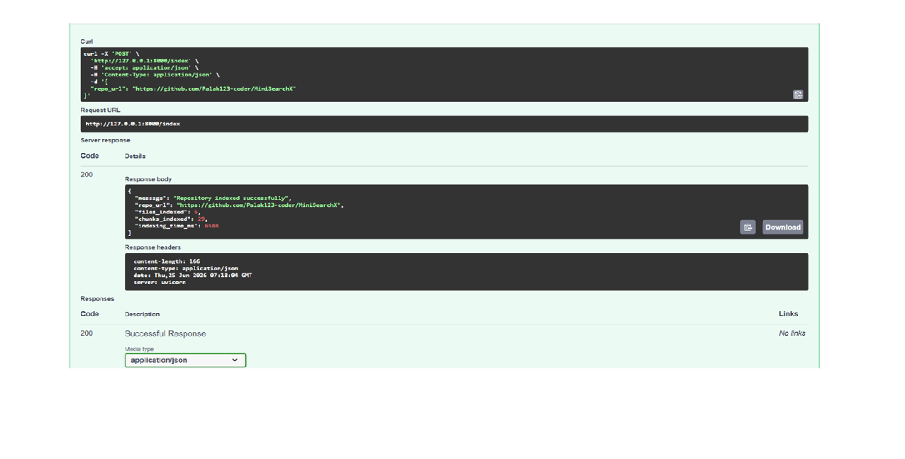
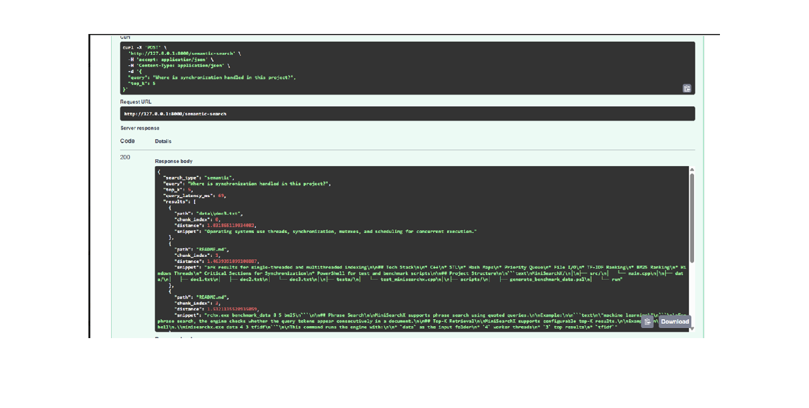
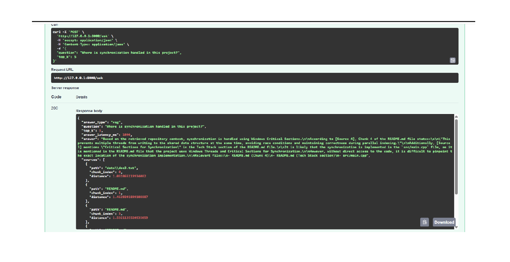

# RepoPilot AI

RepoPilot AI is a FastAPI-based codebase intelligence system that indexes public GitHub repositories and answers developer questions using keyword search, semantic search, and RAG-based answer generation.

The project helps developers understand unfamiliar repositories, locate relevant files, and debug code faster using repository parsing, code chunking, embeddings, vector search, and Groq-powered grounded answers.

## Current Features

* Accepts a public GitHub repository URL
* Clones the repository locally using GitPython
* Parses supported source-code and documentation files
* Ignores heavy/generated folders like `.git`, `node_modules`, `venv`, `dist`, and `build`
* Indexes file paths and file contents
* Supports keyword-based code search through `/search`
* Splits repository files into overlapping code chunks
* Generates embeddings for code and documentation chunks using SentenceTransformers
* Stores semantic vectors in ChromaDB
* Supports semantic code search through `/semantic-search`
* Supports RAG-based question answering through `/ask`
* Uses semantic retrieval over indexed code chunks before generating answers
* Generates grounded answers using Groq LLM with relevant file references
* Returns file paths, chunk indexes, distance scores, snippets, and query latency
* Tracks repository indexing status, files indexed, chunks indexed, indexing time, and errors
* Exposes API documentation through FastAPI Swagger UI

## Tech Stack

* Python
* FastAPI
* Uvicorn
* GitPython
* Pydantic
* Python-dotenv
* ChromaDB
* SentenceTransformers
* Groq API
* RAG

## Project Structure

```text
RepoPilot-AI/
│
├── backend/
│   ├── __init__.py
│   ├── main.py
│   ├── models.py
│   ├── repo_cloner.py
│   ├── file_parser.py
│   ├── search_engine.py
│   ├── chunker.py
│   ├── vector_store.py
│   └── rag_agent.py
│
├── data/
│   ├── .gitkeep
│   └── cloned_repos/
│
├── screenshots/
│   ├── index-success.png
│   ├── semantic-search-success.png
│   └── ask-success.png
│
├── .env.example
├── .gitignore
├── README.md
└── requirements.txt
```

## How It Works

RepoPilot AI follows this workflow:

```text
GitHub repository URL
        ↓
Clone repository using GitPython
        ↓
Parse supported source-code and documentation files
        ↓
Ignore large/generated folders
        ↓
Store files for keyword search
        ↓
Split files into overlapping chunks
        ↓
Generate embeddings for chunks
        ↓
Store embeddings in ChromaDB
        ↓
Retrieve relevant chunks using semantic search
        ↓
Generate grounded answers using Groq LLM
```

## File Parsing

RepoPilot AI supports common source-code and documentation file types, including:

* `.py`
* `.js`
* `.ts`
* `.tsx`
* `.jsx`
* `.java`
* `.cpp`
* `.c`
* `.h`
* `.hpp`
* `.cs`
* `.go`
* `.rs`
* `.php`
* `.rb`
* `.md`
* `.txt`
* `.json`
* `.yml`
* `.yaml`

It ignores folders that are usually large, generated, or unnecessary for code understanding:

* `.git`
* `node_modules`
* `venv`
* `.venv`
* `__pycache__`
* `dist`
* `build`
* `.next`
* `.idea`
* `.vscode`

## Keyword Search

The `/search` endpoint performs keyword-based search.

For each indexed file:

1. The file content is tokenized.
2. The query is tokenized.
3. Query-term matches are counted in each file.
4. Files are ranked by match score.
5. The API returns the top-K relevant files with snippets.

This is useful when the user knows the exact terms they want to search for, such as `multithreading`, `synchronization`, `database`, or `authentication`.

## Semantic Search

The `/semantic-search` endpoint performs semantic search using embeddings and ChromaDB.

For each indexed repository:

1. Parsed files are split into overlapping chunks.
2. Each chunk is converted into an embedding using SentenceTransformers.
3. Embeddings are stored in ChromaDB.
4. User queries are converted into embeddings.
5. ChromaDB retrieves semantically similar chunks.
6. The API returns relevant file paths, chunk indexes, distance scores, snippets, and query latency.

This allows RepoPilot AI to find relevant code even when the query does not exactly match the wording used inside the repository.

Example semantic query:

```text
Where is synchronization handled?
```

## RAG Answer Generation

The `/ask` endpoint performs RAG-based question answering over the indexed repository.

For each question:

1. The question is converted into an embedding.
2. ChromaDB retrieves the most relevant code/documentation chunks.
3. Retrieved chunks are passed to the Groq LLM as grounded context.
4. The LLM generates an answer using only the retrieved repository context.
5. The API returns the answer along with relevant file references.

This makes RepoPilot AI useful for architecture understanding, debugging, and feature-navigation questions.

Example RAG question:

```text
Where is synchronization handled in this project?
```

## API Endpoints

### `GET /`

Checks whether the backend is running.

Example response:

```json
{
  "message": "RepoPilot AI backend is running",
  "version": "0.3.0",
  "status": {
    "status": "idle",
    "repo_url": null,
    "files_indexed": 0,
    "chunks_indexed": 0,
    "indexing_time_ms": 0,
    "error": null
  }
}
```

### `POST /index`

Indexes a public GitHub repository.

Request body:

```json
{
  "repo_url": "https://github.com/Palak123-coder/MiniSearchX"
}
```

Example response:

```json
{
  "message": "Repository indexed successfully",
  "repo_url": "https://github.com/Palak123-coder/MiniSearchX",
  "files_indexed": 6,
  "chunks_indexed": 29,
  "indexing_time_ms": 6588
}
```

### `POST /search`

Performs keyword-based search over indexed repository files.

Request body:

```json
{
  "query": "multithreading synchronization",
  "top_k": 5
}
```

Example response:

```json
{
  "search_type": "keyword",
  "query": "multithreading synchronization",
  "top_k": 5,
  "query_latency_ms": 2,
  "results": [
    {
      "path": "README.md",
      "score": 8,
      "snippet": "This project demonstrates core software engineering concepts including data structures, algorithms, file processing, multithreading, synchronization..."
    }
  ]
}
```

### `POST /semantic-search`

Performs semantic search over indexed code chunks.

Request body:

```json
{
  "query": "Where is synchronization handled in this project?",
  "top_k": 5
}
```

Example response:

```json
{
  "search_type": "semantic",
  "query": "Where is synchronization handled in this project?",
  "top_k": 5,
  "query_latency_ms": 69,
  "results": [
    {
      "path": "data\\doc3.txt",
      "chunk_index": 0,
      "distance": 1.031865119934082,
      "snippet": "Operating systems use threads, synchronization, mutexes, and scheduling for concurrent execution."
    },
    {
      "path": "README.md",
      "chunk_index": 1,
      "distance": 1.4639391899108887,
      "snippet": "Tech Stack\\n\\n- C++\\n- STL\\n- Hash Maps\\n- Priority Queue\\n- File I/O\\n- TF-IDF Ranking\\n- BM25 Ranking\\n- Windows Threads\\n- Critical Sections for Synchronization..."
    }
  ]
}
```

### `POST /ask`

Answers a natural-language question about the indexed repository using semantic retrieval and Groq LLM.

Request body:

```json
{
  "question": "Where is synchronization handled in this project?",
  "top_k": 5
}
```

Example response:

```json
{
  "answer_type": "rag",
  "question": "Where is synchronization handled in this project?",
  "top_k": 5,
  "answer_latency_ms": 1090,
  "answer": "Based on the retrieved repository context, synchronization is handled using Windows Critical Sections. The project uses Critical Sections to prevent multiple threads from writing to the shared data structure at the same time, avoiding race conditions and maintaining correctness during parallel indexing.",
  "sources": [
    {
      "path": "README.md",
      "chunk_index": 4,
      "distance": 1.6006269454956055
    },
    {
      "path": "src\\main.cpp",
      "chunk_index": 6,
      "distance": 1.600897687911987
    }
  ]
}
```

### `GET /status`

Returns the current repository indexing status.

Example response:

```json
{
  "status": "completed",
  "repo_url": "https://github.com/Palak123-coder/MiniSearchX",
  "files_indexed": 6,
  "chunks_indexed": 29,
  "indexing_time_ms": 6588,
  "error": null
}
```

## Setup Instructions

### 1. Clone the repository

```powershell
git clone https://github.com/Palak123-coder/RepoPilot-AI.git
cd RepoPilot-AI
```

### 2. Create a virtual environment

```powershell
py -3.10 -m venv venv
```

### 3. Activate the virtual environment

```powershell
.\venv\Scripts\activate
```

### 4. Install dependencies

```powershell
pip install -r requirements.txt
```

### 5. Configure environment variables

Create a `.env` file in the project root:

```env
GROQ_API_KEY=your_actual_groq_api_key_here
GROQ_MODEL=llama-3.1-8b-instant
```

Do not push `.env` to GitHub. Use `.env.example` as the reference template.

### 6. Run the backend

```powershell
uvicorn backend.main:app
```

For development with auto-reload:

```powershell
uvicorn backend.main:app --reload
```

### 7. Open Swagger UI

Open this URL in your browser:

```text
http://127.0.0.1:8000/docs
```

## Example Usage

### Step 1: Index a repository

Use `POST /index` with:

```json
{
  "repo_url": "https://github.com/Palak123-coder/MiniSearchX"
}
```

### Step 2: Run keyword search

Use `POST /search` with:

```json
{
  "query": "multithreading synchronization",
  "top_k": 5
}
```

### Step 3: Run semantic search

Use `POST /semantic-search` with:

```json
{
  "query": "Where is synchronization handled in this project?",
  "top_k": 5
}
```

### Step 4: Ask a RAG question

Use `POST /ask` with:

```json
{
  "question": "Where is synchronization handled in this project?",
  "top_k": 5
}
```

## Current Demo Metrics

RepoPilot AI successfully indexed the MiniSearchX repository and returned keyword search, semantic search, and RAG answer-generation results.

```text
Files indexed: 6
Chunks indexed: 29
Indexing time: 6588 ms
Keyword query latency: 2 ms
Semantic query latency: 69 ms
RAG answer latency: 1090 ms
```

## Demo Screenshots

### Repository Indexing



### Semantic Search



### RAG Answer Generation



## Current Status

This is version `0.3.0`.

Completed:

* GitHub repository cloning
* Source-file parsing
* Ignored-folder filtering
* Keyword-based search
* Code chunking
* Embedding generation
* ChromaDB vector storage
* Semantic search
* RAG-based answer generation
* Groq LLM integration
* Grounded answers with source file references
* Snippet extraction
* Indexing-status tracking
* Query-latency reporting
* FastAPI Swagger documentation
* Demo screenshots

## Current Limitations

* Supports one indexed repository at a time
* No frontend dashboard yet
* No background worker queue yet
* No persistent job history yet
* No authentication for private repositories yet
* No Docker setup yet
* No unit tests yet

## Upcoming Improvements

* Add Streamlit dashboard
* Add background indexing jobs
* Add retry handling and failed-job logs
* Add Docker support
* Add unit tests
* Add repository summary generation
* Add architecture explanation endpoint
* Add bug-triage suggestions based on retrieved code chunks
* Add support for private repositories
